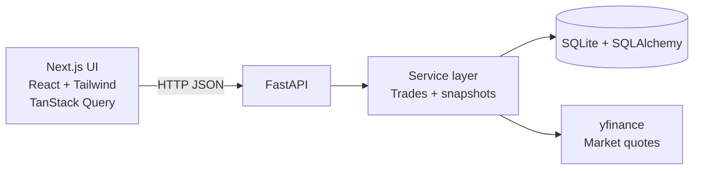

# 42 Macro Paper Trading Portfolio Tracker (Take-Home)

Local-only paper trading app: look up a ticker, place buy/sell orders at the latest Yahoo Finance price available via `yfinance`, track holdings + unrealized P/L, persist a transaction ledger in SQLite, and chart portfolio value using stored snapshots.

**Time note:** This was scoped as a ~2–3 hour take-home; I ended up around ~5 hours to get the UX, charting, and persistence story where I wanted it for review.

## What you can do in the app

- **Ticker lookup** (not full text search): validate a symbol and show a friendly name + last price (best-effort via `yfinance`)
- **Buy / sell** at the looked-up “current” price (paper trading)
- **Portfolio summary**: cash, invested value, total value, unrealized P/L
- **Holdings table** with cost basis + unrealized P/L (per row)
- **Trade history**: full ledger of buys/sells (newest first)
- **Portfolio value chart**: plots persisted `portfolio_snapshots.total_value` over time

## Architecture



**Why this split**

- **FastAPI** isolates trading + persistence from the UI and matches a typical “API service” boundary.
- **SQLite** keeps reviewer setup zero-config (single file DB).
- **Snapshots** decouple charting from “replaying” the full ledger on every chart render (MVP speed).

## Repo layout

- `backend/`: FastAPI service
- `frontend/`: Next.js app

## Prerequisites

- **Node.js** (I used the current LTS line via `nvm`)
- **Python 3.11+** recommended (project uses a `uv` managed venv in `backend/.venv`)
- **uv** (recommended) or your preferred Python toolchain

## Backend setup

From `backend/`:

```bash
uv sync
uv run uvicorn main:app --reload --host 127.0.0.1 --port 8000
```

**Database**

- SQLite file is created next to the backend process as `portfolio.db` (see `backend/database.py`).
- On API startup, SQLAlchemy **creates tables if they don’t exist** (there is no separate migration step for this take-home).
- To reset your local data, **stop the server** and delete `backend/portfolio.db`, then restart (tables will be recreated automatically).

**Docs**

- FastAPI interactive docs: `http://127.0.0.1:8000/docs`

**CORS**

- `backend/main.py` enables CORS for local Next dev. If your Next port changes (ex: `3002`), add it to `allow_origins`.

## Frontend setup

From `frontend/`:

```bash
npm install
npm run dev
```

**API base URL**

Create `frontend/.env.local`:

```bash
NEXT_PUBLIC_API_BASE_URL=http://127.0.0.1:8000
```

## API overview (high-signal)

- `GET /stocks/search?q=AAPL` — ticker lookup + quote fields (best-effort)
- `POST /trades/` — place a trade
- `GET /trades/history` — full transaction history
- `GET /portfolio/summary` — portfolio summary + holdings enrichment
- `GET /portfolio/history` — snapshot series for charting

## Tradeoffs / known limitations (intentional for time)

### Market data (`yfinance`)

- **Not a stable brokerage-grade market data API.** Fields can be missing; failures return HTTP errors.
- Quotes are **not streaming** and not guaranteed “real-time.”

### “Search” vs “lookup”

- The rubric mentions searching by company name. In `yfinance`, reliable **name search** usually needs an autocomplete/index provider or a dedicated search endpoint.
- For this submission, the product behavior is explicitly **ticker lookup** (honest UX + fewer false positives).

**If I had another 2–3 hours:** add a real search backend (cached symbol directory + fuzzy match, or a dedicated free search API), debounced typeahead, and richer result cards.

### Portfolio snapshots

- Snapshots are **event-driven** (updated after trades) and keyed by a **calendar date** (server local day).
- For the “EOD is fine” requirement, snapshot mark-to-market uses the **latest available daily close** from recent Yahoo history (not streaming intraday). This is a pragmatic demo approximation of end-of-day charting, not exchange-official settlement marks.

**If I had more time:** snapshot job on a timer, explicit timezone/market calendar, and clearer separation between “cash ledger” vs “positions cache.”

### Performance

- Portfolio summary recomputes mark-to-market by calling out to Yahoo per holding. Fine for a demo; would batch + cache in production.

## What I’d do next (1–2 hour polish)

- If trade history gets long, add simple pagination or “load more” in the UI (keep the API straightforward)
- Centralize yfinance access behind one `market_data` module (single place for key fallbacks)
- Add minimal integration tests around trade rules (insufficient cash, oversell)

## License / attribution

Built as a take-home assessment. `yfinance` and `lightweight-charts` are third-party libraries with their own licenses.
